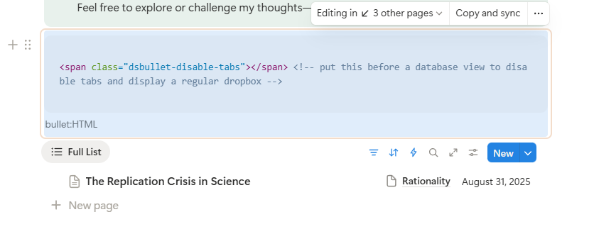

# Bullet Addons by dsent.me

This repository contains custom addons for Bullet that I created and maintain.

Bullet is a publishing platform built on top of Notion that greatly enhances the default Notion web experience
with custom styles, SEO improvements, multilingual support, publishing controls, and more.

You can register for Bullet using my referral link to support my work on these addons: [bullet.so](https://bullet.so/?ref=dsent)

## List of Addons

- [Fading Scroll Effect for the Viewport](src/fading-scroll)  
  Adds a subtle fading effect at the top and bottom of the viewport when scrolling long pages, eliminating the abrupt cut-off.
  This minimalistic script has no configuration options, but you can modify the CSS file to adjust the styling.

## Compatibility Notes

- These addons are designed for the default Bullet template to provide a consistent Notion-like experience.
  Custom Bullet templates may cause some addons to work incorrectly.
- Addons are tested with modern browsers only. While I avoid unsupported features, I don't test or support
  legacy browsers or versions older than 2 years. This keeps the codebase simple, modern, and maintainable.
  I may consider adjustments for specific older browsers if there's a compelling use case, but most legacy browser
  issues will be marked WONTFIX. Feel free to fork the repository for broader compatibility if needed.

## Usage

Most addons include both CSS and JavaScript files. Some may contain only CSS or only JavaScript.

To install an addon:

1. Open your [Bullet dashboard](https://app.bullet.so/dashboard), find your site, and click "Edit."
2. Go to the "Code" tab in the left sidebar.
3. Copy the CSS file contents into the "CSS" area.
4. Copy the JavaScript file contents into the "Body" area, wrapped in `<script>...</script>` tags:

   ```html
   <script type="text/javascript" defer>
    /* -------------------------------------------------------- */
    /* **** SECTION: Fading Scroll Effect for the Viewport **** */
    /* -------------------------------------------------------- */
    ...
    /* ------------------------------------------------------- */
    /* **** END OF: Fading Scroll Effect for the Viewport **** */
    /* ------------------------------------------------------- */
   </script>
   ```

5. Save your changes (click "Save" at the top of the custom code area).
6. Publish your site (click "Publish" at the top right of the dashboard).

To use multiple addons, paste them one after another in the same CSS and JavaScript areas. Large header and footer comments make it easy to identify where each addon begins and ends for future updates or removal.

Each script is self-contained. Dependencies, if any, are noted in the script's comments and README. When present, put dependencies first (this is not a strict requirement as the scripts will try to wait for the requirements to become available, but I still recommend it for clarity).

## Configuration and Customization

Some scripts include configuration options, typically grouped at the top of the file. Edit these values to change the default behavior for your entire site.

You can also apply scripts to specific pages instead of globally by adding CSS and JavaScript to individual page code areas ("Pages" in the left sidebar → select page → "Code" → "Current Page").

However, maintaining page-specific scripts is cumbersome. That's why most scripts support per-page configuration using special HTML markers, which is **the recommended approach**. You can add the script to your site globally and then add specific blocks to your source Notion pages to enable or disable features or change settings.

Add these markers using a code block with the caption `bullet:HTML` (see [Embed HTML inside Notion](https://bullet.so/docs/embed-html-inside-notion/) in Bullet documentation). For details, refer to each script's readme file and comments.

**Tip:** Create synced blocks in Notion (e.g., in a template page) and copy-sync them where needed. Remember that editing a synced block changes all copies, so this only works for **identical** configurations. If you need a few different configurations, create separate synced blocks for each.

Most marker blocks can be empty and invisible, so it's safe to place them anywhere on the page.

Some markers affect subsequent blocks or their parent block—check each script's documentation for details.

An example of a marker block on a Notion page:



This marker prevents the list below it from rendering as tabs and forces it to display as a default dropdown list. The marker doesn't affect other lists or other database views on the page.

## Licensing and Contributions

- This repository is licensed under the [MIT license](LICENSE).
- For different licensing options, please [contact me](#author-and-contact).
- Contributions are welcome. Open issues or submit pull requests to the public repository. Site-specific or sensitive content will not be accepted.

## Security & Privacy

- Do not commit secrets or site-specific credentials. This repository contains only static CSS and client-side scripts that require no server credentials.

## Roadmap / Next Steps

- None published yet.

## Author and Contact

- Learn more about my work at [dsent.me](https://dsent.me).
- For questions or sponsorship opportunities: [Telegram](https://t.me/dsent_zen) or [email](mailto:info@dsent.me).
