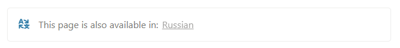

# Language Selector Links

This script improves the user experience for a multilingual site built on Notion and Bullet.

You designate some pages as translations of each other, and the system automatically generates a helpful outline, linking all translations of the current page on each page. Moreover, the standard Bullet language switcher in the header links to the correct localized version of each page instead of just linking to the home page of the selected language.

The [styles included with this script](link-outlines.css) are also useful for other applications. For example, I reuse them to display a list of links to the current page's content posted on other platforms (e.g. Facebook, Twitter etc.). The same setup can be used for other purposes, such as linking to different versions of the same content (e.g. PDF, text, audio, video etc.).

You can see how it looks and works on my site: [dsent.me](https://dsent.me).

I'll be frank: this feature is quite complicated to explain and set up. It requires a very specific configuration in your Notion database to work properly. If anyone is actually interested in setting this up, please contact me so I know there's demand and invest the time in writing a detailed guide.

For now, I'll just put it out here for anyone curious enough to explore the code. This is a version I use on my own site, with no real configuration and a bunch of hardcoded assumptions. It may not work for your use cases, but feel free to contact me or fork the code.
