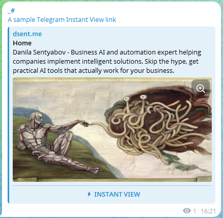
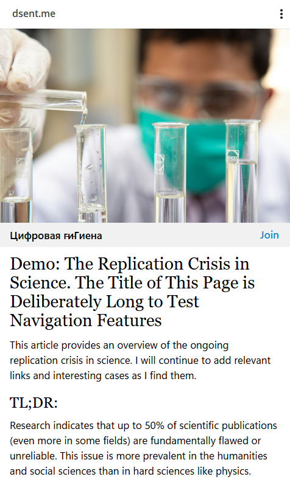

# Telegram Instant View Template (Notion → Telegram)

This is a Telegram Instant View (TIV) template for dsent.me.

TIV is a way to create lightweight, fast-loading versions of web pages optimized for reading.
If a page has a valid IV template, Telegram adds a special card to a posted link that
allows users to open the IV version of the page:


Clicking the button opens a simplified, text-focused version of the page. If the page has
a link to a Telegram channel (`<meta name="telegram:channel" content="@your_channel_name">`
in the `<head>` section), it will also show the channel name and allow users to join it:


It has a bit of site-specific logic, but can be adapted for other Bullet/Notion-powered
sites with similar structure.

I'm sharing it here for reference so you can make the experience better for your
users if you also use Bullet for content publishing and share your articles on Telegram.

## Quick Start

1. Log into [Telegram Instant View Editor](https://instantview.telegram.org/my/).
2. Enter a sample URL of a specific page suitable for instant view to create a new template
   (it must have article-like content, not a homepage, index, or interactive page).
3. Paste the contents of `dsent.me.tgiv` into the `RULES` section of the editor.
4. Adjust the site-specific rules for your site.
5. Click `TRACK CHANGES` to validate and save.
6. Add a few other sample URLs to test. You'll need at least 10 URLs tested valid to publish the template.

Refer to the repo root README for general project context: `../../README.md`.

## Publishing

Publishing the template will make all links to your site in Telegram show the IV card,
no matter who shares them and where. However, it's a subject to Telegram's review and approval,
which can take an unpredictable amount of time or never happen.

Fortunately, you can start using the template right away in your own Telegram channels by
posting specially formatted links instead of regular links to your articles.

The format is:

```plaintext
https://t.me/iv?url={URL_ENCODED_ARTICLE_URL}&rhash={TEMPLATE_RHASH}
```

For example:

```plaintext
https://t.me/iv?url=https%3A%2F%2Fdsent.me%2F&rhash=f9e7c95efdf170
```

There is a number of online URL encoder tools (e.g. [this](https://www.urlencoder.io/)) you can use to get an URL-encoded version of your article link from a regular link (e.g. `https%3A%2F%2Fdsent.me%2F` from `https://dsent.me/`).

The `rhash` parameter is the unique identifier of your template. You can find out what it is by clicking `VIEW IN TELEGRAM` in the upper right corner of the IV editor:


## Configuration

Two optional per-page markers can be inserted using Bullet's `HTML` block (Notion custom code). These spans can appear anywhere inside the page content. Wrapping inside a synced block is also supported (template unwraps those).

### 1. Set a custom Telegram channel

Use when you want Telegram to display a different channel attribution for a specific article.

```html
<span class="dsbullet-telegram-channel" data-telegram-channel="@your_channel_handle" />
```

### 2. Disable Instant View for a page

Use if a page relies on interactive content or database views (currently stripped by the template).

```html
<span class="dsbullet-disable-tiv" />
```

### 3. Adjusting scope

Currently applies site-wide. To restrict (e.g., language folders), uncomment / edit the `?path` rule near the top of `dsent.me.tgiv`:

```text
# ?path: ^/(ru|en)/
```

## Notes / Troubleshooting

- If IV fails to generate: Check the IV editor log — usually a missing required element
  (body or title) or unsupported content (e.g. an image inside an `<a>` element).
- Use `@debug:` to inspect elements during development.
- Read the [Telegram IV documentation](https://instantview.telegram.org/docs/) for details on the DSL and available features.
- Use XPath cheatsheets like [this](https://devhints.io/xpath) or [this one](https://www.freecodecamp.org/news/xpath-cheat-sheet/) to help with writing selectors.
- Use the Dev Tools console (F12 in Chrome or Edge) to test XPath selectors:

  ```js
   $x('//article//h1')
   $x('//article//h1//span[contains(@class, "notion-title")]')
   ```

## License & Support

This project is licensed under the MIT License (see the [LICENSE](../../LICENSE) file for details).

Public repository: [dsent/bullet-addons](https://github.com/dsent/bullet-addons)

For support, please [open an issue](https://github.com/dsent/bullet-addons/issues) on GitHub.

© 2025 Danila Sentyabov ([dsent.me](https://dsent.me))
